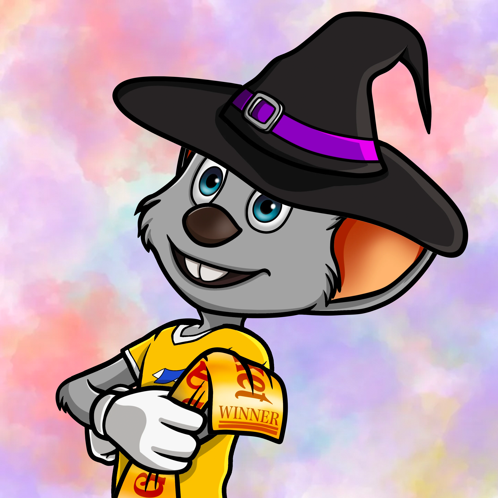

<!-- omit in toc -->
# Blockchain Challenge 2022 - Technical Documentation
<!-- omit in toc -->
## Team 8 
<!-- omit in toc -->
### Short description

This is a website with *Web3* functionality to mint NFTs.
Eligible users who received a giftcard, can mint an NFT using the giftcard code.
The fees are paid by the contract owner.

The smart contract is stored on the Polygon chain to reduce gas fees.
<!-- omit in toc -->
# Table of Contents
- [Introduction](#introduction)
- [NFT creation](#nft-creation)
  - [Pictures](#pictures)

# Introduction

This documentation describes the technical implementation of the business extension for the case of *Blackhawk Network*. The basic idea of this implementation is to gift NFTs to eligible gift card holders. Moreover, the website and the smart contract are functioning in such a way that the gift card holder does not pay any minting or transaction fees.

The following chapters will explain various processes such as creating and uploading the NFTs, compiling and verifying the smart contracts and adding web3 functionality to the website.

The following software, frameworks and programming languages are used:

- Visual Studio Code (IDE)
- JavaScript
- Node.js (Website development)
- Solididty (Smart Contract development)
- Next.js (Website development)
- Hardhat (Smart Contract compilation, deployment and verification)

# NFT creation

## Pictures

In order to create an entire NFT collection, the best approach is to create layers and then combine them to an entire picture. We created the following layers:

- Background
  - aquamarine
  - blue
  - darkblue
  - green
  - orange
  - purple
  - red
  - violet
  - yellow
- Base
  - normal
  - Frankenstein
- Body
  - black
  - Dracula
  - EuropaPark
  - Skeleton
- Hand
  - Bone
  - Broom
  - Pumpkin
- Head
  - Spider
  - Witch hat

Additionally we created 3 *winner NFTs*, which have special background and a winning ticket as the *hand* attribute.

