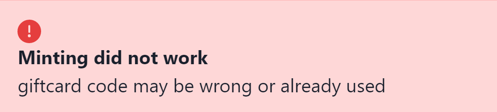
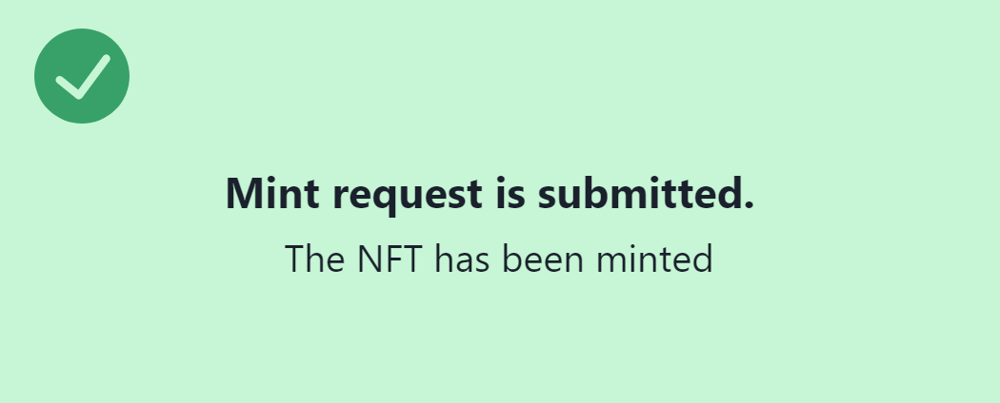

<!-- omit in toc -->
# Blockchain Challenge 2022 - Technical Documentation
<!-- omit in toc -->
## Team 8

### Sandra Baader, Lukas Bütikofer, Sercan Ates, Leonardo Norambuena

<!-- omit in toc -->
### Short description

This is a website with *Web3* functionality to mint NFTs. Eligible users who received a gift card can mint an NFT using the gift card code. The fees are paid by the contract owner. The smart contract is stored on the Polygon Mumbai testnet chain to reduce gas fees.

All codes are stored on the GitHub repository of this page.
<!-- omit in toc -->
# Table of Contents

- [Introduction](#introduction)
- [NFT creation](#nft-creation)
  - [Pictures & Metadata](#pictures--metadata)
- [Smart Contract](#smart-contract)
- [Website](#website)
  - [General](#general)
  - [Home Page](#home-page)
  - [Team page](#team-page)
  - [NFTs](#nfts)
- [Summary](#summary)

# Introduction

This documentation describes the technical implementation of the business extension for the case of [*Blackhawk Network*](https://blackhawknetwork.ch/). The basic idea of this implementation is to gift NFTs to eligible gift card holders. Moreover, the website and the smart contract are functioning in such a way that the gift card holder does not pay any minting or transaction fees.

The following chapters will explain various processes such as creating and uploading the NFTs, compiling and verifying the smart contracts, and adding web3 functionality to the website.

The following software, frameworks, and programming languages are used:

- Visual Studio Code (IDE)
- JavaScript (Programming language)
- Node.js (Website development)
- Solidity (Smart Contract development)
- Next.js (Website development)
- Ethers.js (Web3 package for JS)
- [Hardhat](https://hardhat.org/) (Smart Contract compilation, deployment and verification)
- [Infura](https://infura.io/) (Ethereum API)
- [Vercel](https://vercel.com/) (Website deployment)

# NFT creation

## Pictures & Metadata

In order to create an entire NFT collection, the best approach is to create layers and then combine them into an entire picture. We created the following layers:

|Layers|Attributes|
|---|---|
|Background|  aquamarine, dark blue, green, orange, purple, red, yellow, violet|
|Base|normal, Frankenstein|
|Body|black, Dracula, Europa Park, Skeleton|
|Hand|Bone, Broom, Pumpkin|
|Head|Spider, Witch Hat

Additionally, we created 3 *winner NFTs*, which have a special background and a winning ticket as the *hand* attribute.

|  |
|:--:|
| *A Winner NFT* |

Picture creating and metadata generation was made via [*HashLips Art Engine*](https://github.com/HashLips/hashlips_art_engine). Hashlips is a JavaScript-based program, which combines image layers to generate unique pictures. We configured the NFT-creating as the following:

```javascript
// Some of the Hashlips configurations. For more info, visit GitHub

const namePrefix = "Euro Mouse Halloween Special";
const description = "Limited NFT collection, only gift card holders are eligible";
const layerConfigurations = [
  {
    growEditionSizeTo: 98, // will be 101 with the 3 winner NFTs
    layersOrder: [
      { name: "Background"},
      { name: "Base" },
      { name: "Body" },
      { name: "Hand" },
      { name: "Head" },
    ],
  },
];
const shuffleLayerConfigurations = false;
const format = {
  width: 3000,
  height: 3000,
  smoothing: false,
};
```

 After that, the pictures were uploaded to *IPFS* via [*Pinata*](https://pinata.cloud). Pinata is a free service for uploading NFTs to the IPFS. Once the pictures were uploaded, we used the content identifier *CID* of the picture folder and pasted it in the JSON metadata of each NFT. A content identifier serves as a label to point to files in the IPFS.

```json
"Json metadata example"
{
  "name": "Euro Mouse Halloween Special #1",
  "description": "Limited NFT collection, only gift card holders are eligible",
  "image": "https://ipfs.io/ipfs/QmekegUZUEtR2oHhSBctX5EuTSY87d54TAdsnWfn4SYS4J/1.png",
  "dna": "70867f47a5e343864d0b308a123e419bdaebf39d",
  "edition": 1,
  "date": 1651416943881,
  "creator": "BCC22 - Team 8",
  "attributes": [
    {
      "trait_type": "Background",
      "value": "blue"
    },
    {
      "trait_type": "Base",
      "value": "normal"
    },
    {
      "trait_type": "Body",
      "value": "EuropaPark"
    },
    {
      "trait_type": "Hand",
      "value": "Bone"
    },
    {
      "trait_type": "Head",
      "value": "Spider"
    }
  ],
  "compiler": "HashLips Art Engine"
}
```

After that, the JSON metadata was uploaded to IPFS as well.  
___  

| **Datatype**   | **CID**                                          |
| -------------- |:------------------------------------------------:|
| Pictures       | QmekegUZUEtR2oHhSBctX5EuTSY87d54TAdsnWfn4SYS4J   |
| Metadata       | QmVDk6AH85uETgjip2tH4kCko76u2sHGhwGpbof8eWGgtg   |  

___

# Smart Contract

We used the Solidity version `^0.8.9`, since this is the latest officially supported version from hardhat. The used compiler is `0.8.13+commit.abaa5c0e.Emscripten.clang`.

```javascript
// part of the hardhat config file
module.exports = {
  solidity: "0.8.9",
  networks: {
    mumbai: {
      url: process.env.NEXT_PUBLIC_MUMBAI_RPC_URL,
      accounts: [process.env.NEXT_PUBLIC_PRIVATE_KEY]
    },
  },
  etherscan: {
    apiKey: process.env.NEXT_PUBLIC_MUMBAI_KEY ,
  },
};
```

The smart contract inherits the ERC721 contract standard from [openzeppelin](https://github.com/OpenZeppelin/openzeppelin-contracts/tree/master/contracts/token/ERC721). Besides that, the `Ownable` contract from openzeppelin is also inherited. The following variables are used for this contract:

```solidity
contract EuroMouse is ERC721, Ownable {
    uint256 public tokenId;
    uint256 public maxSupply = 101;
    bool public isMintEnabled; //default is false
    string private baseTokenURI;
```

The maximum supply is set at 101 - the entirety of the NFT collection. It can be adjusted afterward if needed.

```solidity
function setMaxSupply(uint256 maxSupply_) external onlyOwner {
        maxSupply = maxSupply_;
    }
```

After that, the minting process has to be enabled manually by the contract owner. This is useful, since we may want to enable minting only during a certain time.

```solidity
function toggleIsMintEnabled() external onlyOwner {
        isMintEnabled = !isMintEnabled; // default is false
    }
```

The mint function can be executed only by the owner of the contract. It receives two inputs - the receiver of the token and the token ID. Thus, the contract owner pays minting fees. The receiver gets the token via *airdrop*.

```solidity
function mint(address _receiver, uint256 tID) public onlyOwner {
        require(isMintEnabled, "minting not enabled");
        require(tokenId <= maxSupply, "out of range");
        _safeMint(_receiver, tID);
    }
```

The `baseURI` can either be set as a constructor variable when deploying the contract, or it can be set/changed later using the `setBaseURI` function.

```solidity
constructor(string memory baseURI) ERC721('BCC EuroMouse - Halloween Edition', 'EUMOUSE') {   
        setBaseURI(baseURI);     // can set baseURI when deploying the contract
    }

    function _baseURI() internal view virtual override returns (string memory) {
     return baseTokenURI; // returns the baseTokenURI.
    }

    function setBaseURI(string memory _baseTokenURI) public onlyOwner {
     baseTokenURI = _baseTokenURI; // can set a (new) baseTokenURI
     
    }  
```

The contract was compiled, deployed, and verified using [*hardhat*](https://hardhat.org/) on the Polygon Mumbai Testnet. Infura was used as an API provider to connect to the Polygon Mumbai Testnet.

**Contract Address:**  0x5F2e8a39C08EE760Fb97247f5e446C0E67296D2e 

**Verified code:** <https://mumbai.polygonscan.com/address/0x5F2e8a39C08EE760Fb97247f5e446C0E67296D2e#code>  

The full code can also be found in the [contracts](https://github.com/buenavista62/BCC22_new/tree/main/contracts) folder.

# Website

## General

We used *next.js* as the technical frame to build the website. There are 3 pages, *home page*, *team* and *NFTs*. All keys have been stored as *environment variables* and will be accessed from the frontend via 'process.env'. This setup is not suitable for a *mainnet* solution, since the keys are exposed on the frontend.

## Home Page

The home page provides the main functionality for the user. It consists of a submit form and a text block with instructions. The user can visit the website by scanning the *QR-code* on his gift card. Afterward, the user can type in his/her gift card code and wallet address and click on submit.

|  |
|:--:|
| *Submit form* |

The submit form accepts only 6-digit-codes and 40-digit addresses. An error message appears if the gift card code is wrong or already used. If both code and wallet address are valid, a success message will appear.

|  |
|:--:|:--:|
| *Error message* | *Success message*|

All eligible codes are stored as environment variables. The codes are random 6-digit integers.

```python
# generating giftcard codes (python)
import random as rd
arr = []
for i in range(101):
    arr.append(rd.randint(100000,999999)) # 101 random codes

len(arr) == len(set(arr)) # check whether the codes are unique
```

After minting, the used gift card code will be stored in another array, which contains all used gift card codes. The index of a given gift card code determines the token ID when minting an NFT.

```javascript
var codes = JSON.parse(process.env.NEXT_PUBLIC_CODES); // valid codes
var usedcodes = []; // storing used codes

async function mintit(Addr, TokenID) { // mint function
    try {
      const response = await contract.mint(Addr, BigNumber.from(TokenID));
      console.log("response:", response);
    } catch (err) {
      console.log("error: ", err);
    }
  }

function onSubmit(values) {
    let Addr = ethers.utils.getAddress(values["ethaddr"]); // receiver address
    let ind = codes.indexOf(parseInt(values["Giftcard code"])); // returns -1 if the code is not valid
    let TokenID = codes.indexOf(parseInt(values["Giftcard code"])) + 1; // token id, which is the same as the index of the code in the array
    let ind2 = usedcodes.indexOf(parseInt(values["Giftcard code"])); // returns -1 if the code is not used
    if (ind == -1 || ind2 !== -1) {
      return new Promise((resolve) => {
        setTimeout(() => {
          setDisplay(""); // enable error message
          setSudisplay("none"); // disable success message
          resolve();
        }, 3000);
      });
    } else {
      return new Promise((resolve) => {
        setTimeout(() => {
          mintit(Addr, TokenID); // execute mint function
          usedcodes.push(parseInt(values["Giftcard code"])); // add the used code to the 'used codes' array
          setDisplay("none"); // disable error message
          setSudisplay(""); // enable success message
          resolve();
        }, 3000);
      });
    }
  }
```

## Team page

The [team page](https://bcc-giftcards.vercel.app/team) contains some further information about us as a team.

## NFTs

The [NFTs page](https://bcc-giftcards.vercel.app/nfts) is an image gallery, which shows 20 NFTs from the collection.

# Summary

The creation of a smart contract to mint NFTs is rather simple. There are many examples and well-tested contracts from openzeppelin, which ensure secure contracts. However, all the additional work regarding the artwork, picture and metadata generation, and having a functional website are very time-consuming. Understanding smart contracts and knowing Solidity was not enough. Web development skills were also needed. This technical implementation can also be used for mainnet solutions, given that all secret keys (API, private key) are not exposed to the frontend.
