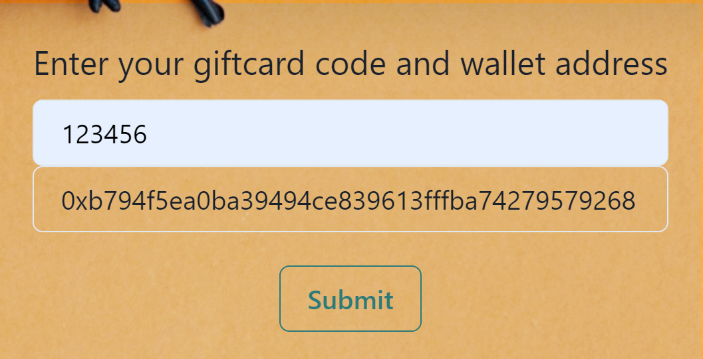

<!-- omit in toc -->
# Blockchain Challenge 2022 - Technical Documentation
<!-- omit in toc -->
## Team 8
<!-- omit in toc -->
### Short description

This is a website with *Web3* functionality to mint NFTs.
Eligible users who received a giftcard, can mint an NFT using the giftcard code.
The fees are paid by the contract owner.

The smart contract is stored on the Polygon chain to reduce gas fees.
<!-- omit in toc -->
# Table of Contents

- [Introduction](#introduction)
- [NFT creation](#nft-creation)
  - [Pictures & Metadata](#pictures--metadata)
- [Smart Contract](#smart-contract)
- [Website](#website)
  - [General](#general)
  - [Home Page](#home-page)

# Introduction

This documentation describes the technical implementation of the business extension for the case of *Blackhawk Network*. The basic idea of this implementation is to gift NFTs to eligible gift card holders. Moreover, the website and the smart contract are functioning in such a way that the gift card holder does not pay any minting or transaction fees.

The following chapters will explain various processes such as creating and uploading the NFTs, compiling and verifying the smart contracts and adding web3 functionality to the website.

The following software, frameworks and programming languages are used:

- Visual Studio Code (IDE)
- JavaScript (Programming language)
- Node.js (Website development)
- Solidity (Smart Contract development)
- Next.js (Website development)
- Ethers.js (Web3 package for JS)
- [Hardhat](https://hardhat.org/) (Smart Contract compilation, deployment and verification)
- [Infura](https://infura.io/) (Ethereum API)
- [Vercel](https://vercel.com/) (Website deployment)

# NFT creation

## Pictures & Metadata

In order to create an entire NFT collection, the best approach is to create layers and then combine them to an entire picture. We created the following layers:

|Layers|Attributes|
|---|---|
|Background|  aquamarine, darkblue, green, orange, purple, red, yellow, violet|
|Base|normal, Frankenstein|
|Body|black, Dracula, Europa Park, Skeleton|
|Hand|Bone, Broom, Pumpkin|
|Head|Spider, Witch Hat

Additionally we created 3 *winner NFTs*, which have special background and a winning ticket as the *hand* attribute.

|  |
|:--:|
| *A Winner NFT* |

Picture creating and metadata generation were made via [*HashLips Art Engine*](https://github.com/HashLips/hashlips_art_engine). Hashlips is a JavaScript based program, which combines image layers to generate unique pictures. We configured the NFT creating as the following:

```javascript
// Some of the hashlips configurations. For more info, visit github

const namePrefix = "Euro Mouse Halloween Special";
const description = "Limited NFT collection, only gift card holders are eligible";
const layerConfigurations = [
  {
    growEditionSizeTo: 98,
    layersOrder: [
      { name: "Background"},
      { name: "Base" },
      { name: "Body" },
      { name: "Hand" },
      { name: "Head" },
    ],
  },
];
const shuffleLayerConfigurations = false;
const format = {
  width: 3000,
  height: 3000,
  smoothing: false,
};
```

 After that, the pictures were uploaded to *IPFS* via [*Pinata*](https://pinata.cloud). Once the pictures were uploaded, we used the content identifier *CID* of the picture folder and pasted it in the JSON-metadata of each NFT.

```json
"Json metadata example"
{
  "name": "Euro Mouse Halloween Special #1",
  "description": "Limited NFT collection, only gift card holders are eligible",
  "image": "https://ipfs.io/ipfs/QmekegUZUEtR2oHhSBctX5EuTSY87d54TAdsnWfn4SYS4J/1.png",
  "dna": "70867f47a5e343864d0b308a123e419bdaebf39d",
  "edition": 1,
  "date": 1651416943881,
  "creator": "BCC22 - Team 8",
  "attributes": [
    {
      "trait_type": "Background",
      "value": "blue"
    },
    {
      "trait_type": "Base",
      "value": "normal"
    },
    {
      "trait_type": "Body",
      "value": "EuropaPark"
    },
    {
      "trait_type": "Hand",
      "value": "Bone"
    },
    {
      "trait_type": "Head",
      "value": "Spider"
    }
  ],
  "compiler": "HashLips Art Engine"
}
```

After that the JSON-metadata was uploaded to IPFS as well.  
___  

| **Datatype**   | **CID**                                          |
| -------------- |:------------------------------------------------:|
| Pictures       | QmekegUZUEtR2oHhSBctX5EuTSY87d54TAdsnWfn4SYS4J   |
| Metadata       | QmVDk6AH85uETgjip2tH4kCko76u2sHGhwGpbof8eWGgtg   |  

___

# Smart Contract

The smart contract inherits the ERC721 contract standard from openzeppelin. When constructing the contract, the *base URI* of the tokens are set. The maximum supply is set at 101 - the entirety of the NFT collection. It can be adjusted afterwards if needed. After that, the minting process has to enabled manually by the contract owner. This is useful, since we may want to enable minting only during a certain time.

```solidity
function toggleIsMintEnabled() external onlyOwner {
        isMintEnabled = !isMintEnabled; // default is false
    }
```

The mint function can be executed only by the owner of the contract. It receives two inputs - the receiver of the token and the token id. Thus, the contract owner pays minting fees. The receiver gets the token via *airdrop*.

```solidity
function mint(address _receiver, uint256 tID) public onlyOwner {
        require(isMintEnabled, "minting not enabled");
        require(tokenId <= maxSupply, "out of range");
        _safeMint(_receiver, tID);
    }
```

The contract was compiled, deployed and verified using [*hardhat*](https://hardhat.org/) on the Polygon Mumbai Testnet. Infura was used as the an API provider to connect to the Polygon Mumbai Testnet.

**Contract Address:**  0xAFB3e72bEf11C13C572fD8112bAE95c983a5DDe3  

**Verified code:** <https://mumbai.polygonscan.com/address/0xAFB3e72bEf11C13C572fD8112bAE95c983a5DDe3#code>  

The full code can also be found in the [contracts](contracts/EuroMouse.sol) folder.

# Website

## General

We used *next.js* as the technical frame to build the website. There are 2 pages, *home page* and *team*. All keys have been stored as *environment variables* and will be accessed from the frontend via 'process.env'. This setup is not suitable for a mainnet solution, since the keys are exposed on the frontend.

## Home Page

The home page provides the main functionality for the user. It consists of a submit form and a text block with instructions. The user can visit the website by scanning the *QR-code* on his giftcard. Afterwards, the user can type in his/her giftcard code and wallet address and click on submit.

|  |
|:--:|
| *Submit form* |
